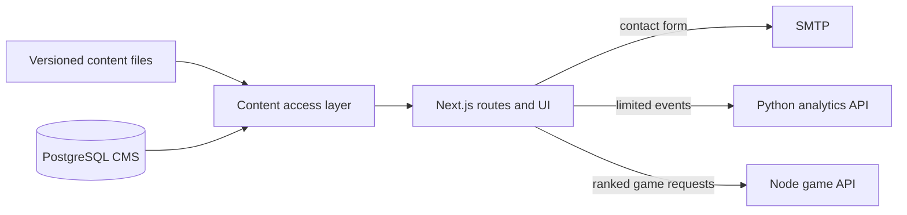

# David Rizky Wijaya | Portfolio & CMS

[Live website](https://davidrwijaya.site) · [Works](https://davidrwijaya.site/works) · [Playground](https://davidrwijaya.site/playground)

This repository contains the public portfolio, its optional content management system, and the small services that support analytics and the Off the Clock game. The site presents professional work as case studies with explicit evidence, while Playground holds personal experiments that invite exploration.

## How the pieces fit



The site starts with versioned content in `web/content`. `web/lib/content.ts` gives pages one set of read functions, regardless of whether the active source is files or the CMS. This keeps page components independent of storage. When the CMS is enabled, a missing database document stays missing; the application does not silently substitute an older file.

The file source also acts as a quality gate. The content layer validates project metadata, detail references, ordering, and evidence levels with Zod. A broken entry fails during build instead of producing an incomplete case study in production.

| Area | What it does | Main code |
| --- | --- | --- |
| Works | Lists published projects and renders their case studies | `web/content/projects.ts`, `web/components/projects`, `web/components/case-study` |
| Playground | Lists experiments, including the Off the Clock pixel world | `web/content/playground.ts`, `web/components/off-the-clock` |
| CMS | Edits and publishes content through a protected admin interface | `web/app/admin`, `web/lib/cms`, `web/drizzle` |
| Contact | Sends a visitor message and receipt through server-side SMTP | `web/app/api/contact`, `web/lib/contact-email.ts` |
| Analytics | Collects a small allowlist of events and produces thresholded reports | `web/lib/analytics.ts`, `analytics-api` |
| Pantry game | Verifies ranked runs and stores the leaderboard | `web/game-server`, `web/app/api/off-the-clock` |

The main application uses Next.js 16, React 19, TypeScript, Motion, and GSAP. The analytics API uses Python's standard library. The CMS uses PostgreSQL, Drizzle, and Better Auth. The game API uses Node.js and SQLite.

## Run the portfolio locally

Use Node.js 22 and npm. The public pages work without PostgreSQL, SMTP, or the analytics service.

```sh
git clone https://github.com/drwijaya/drw-PortfolioCMS.git
cd drw-PortfolioCMS/web
npm ci
npm run dev
```

Open `http://localhost:3000`. To set local metadata URLs or try optional services, copy `web/.env.example` to `web/.env` and edit its values. In local development, use `NEXT_PUBLIC_SITE_URL=http://localhost:3000`; leave `NEXT_PUBLIC_ANALYTICS_API_URL` empty until you have a collector. Keep all SMTP keys and CMS credentials outside Git.

The Contact page offers a direct email link when SMTP is unavailable. Follow [the email setup guide](web/CONTACT-EMAIL-SETUP.md) to enable form delivery. The CMS needs a separate database, credentials, and access policy; follow [the CMS operations guide](web/scripts/cms/README.md) before enabling its Compose overlay.

## Change portfolio content

Professional work begins in `web/content/projects.ts`. Each published project has a unique `slug` and `portfolioRank`, a thumbnail, a short card statement, and a `detailSlug`. Add the corresponding detail in `web/content/case-studies`, `web/content/project-details`, or `web/content/design-portfolios`, then register it in that directory's `index.ts`. Put referenced images under `web/public/img`.

`portfolioRank` is the reading order for the Works page, its case-study sidebar, and the footer navigation. Keeping that order in the content record prevents the three interfaces from drifting apart. A case study also declares a proof level that must match its detail's evidence record.

Playground entries live in `web/content/playground.ts`. `playgroundRank` controls the Playground index; `listedAt` selects recent entries for the rail on Works. An internal experiment also needs a route under `web/app/(site)/playground`.

After editing content, run `npm run check` from `web/`. The build validates the content records and generates pages and metadata from the same source.

## Checks

| Command | What it verifies |
| --- | --- |
| `cd web && npm run typecheck` | TypeScript contracts |
| `cd web && npm run lint` | ESLint rules, with zero warnings allowed |
| `cd web && npm run build` | Production compilation and content validation |
| `cd web && npm run check` | All three web checks in sequence |
| `python3 -m unittest discover -s analytics-api -p 'test_*.py'` | Analytics API regression tests |

[GitHub Actions](.github/workflows/check.yml) runs the web checks and analytics tests on pushes and pull requests. The production Dockerfile runs `npm run check` before it creates the runtime image.

## Deployment and service boundaries

`web/Dockerfile` produces a standalone Next.js image. `web/compose.yaml` defines the portfolio, analytics collector, and game API. Its loopback port bindings and Cloudflare Tunnel comments describe this site's current host; review those settings before using Compose on another machine. Public URLs supplied through `NEXT_PUBLIC_*` are baked into the web build, so set them before building the image.

The CMS overlay in `web/compose.cms.yaml` switches the content source to PostgreSQL and adds the database and background worker. It is an explicit deployment choice. The [operations guide](web/scripts/cms/README.md) covers migration, owner bootstrap, access control, backups, and recovery.

The browser skips analytics on localhost, admin routes, and when `Do Not Track` is enabled. The collector accepts only known event names and properties; it hashes visitor and session identifiers and applies a minimum session threshold to location reports. The contact API keeps SMTP credentials on the server. These measures reduce collected data, but deployment still requires correct origins, secrets, backups, and access policies.

## Repository scope and rights

Git tracks application source, published assets, and database migrations. It excludes local build output, screenshots from review sessions, backups, export archives, credentials, and private source documents used to write case studies.

The repository's **code** is licensed under [MIT](LICENSE). Portfolio writing, case-study media, logos, and third-party assets may have separate rights.
